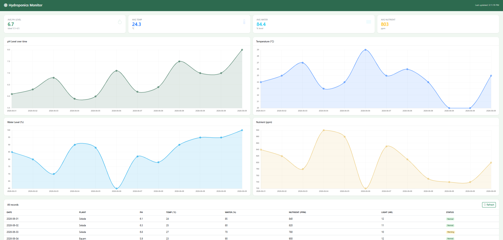
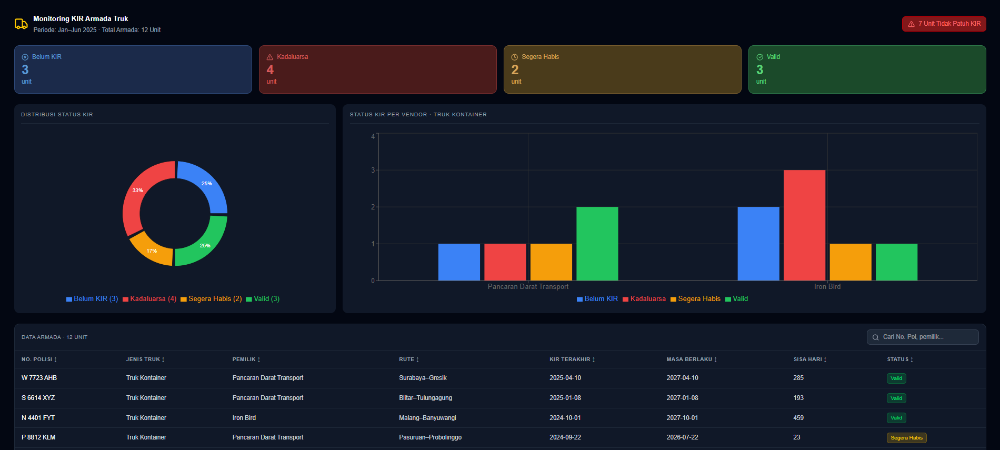

# Google Sheet Monitoring Project

A full-stack monitoring dashboard that pulls live data from Google Sheets and visualizes it in real-time using Next.js and Chart.js.

## Tech Stack
- **Frontend:** Next.js, Tailwind CSS, Recharts
- **Data Source:** Google Sheets (CSV API)
- **Charts:** Recharts (Donut, Bar)

---

## Projects

### 🌱 Monitoring Hydroponic Plant
A real-time dashboard for monitoring hydroponic plant conditions including pH level, temperature, water level, and nutrient concentration.

---

### 🚛 KIR Monitoring Trucking
A fleet management dashboard for monitoring truck KIR (vehicle inspection) certification status. Features include status filtering, sortable table, search, and auto-refresh every seconds.

